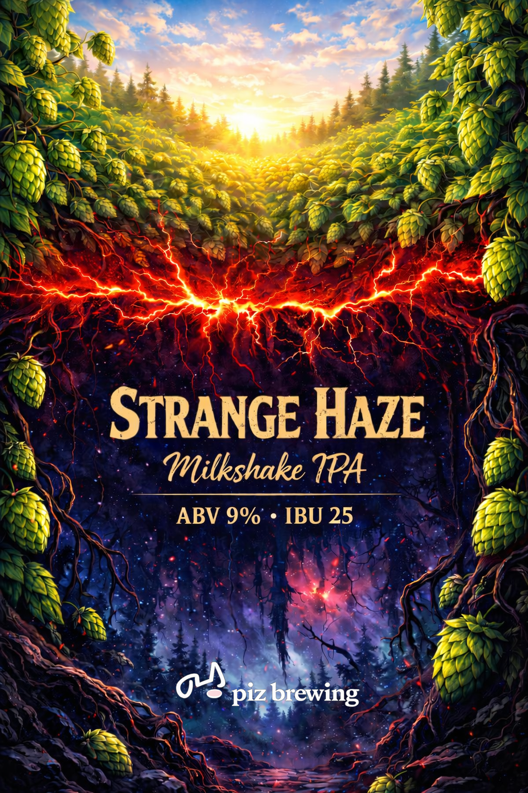

# Strange Haze · Imperial Milkshake IPA

> 藍莓香草奶昔 · 濃而不甜膩 · 紫色貼合酒標星雲

## 📊 當前狀態

| 項目 | 規格 |
|---|---|
| **目前最新版本** | [v1 藍莓香草](./v1-blueberry-vanilla.html) |
| 風格 | Imperial Milkshake IPA |
| 容量 | 10 L |
| OG | 1.072-1.076 |
| FG | 1.016-1.018 |
| **酒標標示 ABV** | **9%**(已印,不改) |
| 實際釀造 ABV | 7.5-8%(略降,口感更平衡,喝不出差異) |
| IBU | ~25(照酒標) |

## 🏷️ 關於酒標

酒標 Strange Haze 已印製,標示 **ABV 9% · IBU 25**,無法更改。實際釀造 ABV 略降到 7.5-8%,口感更平衡、更好釀,喝的人不會察覺差異。

酒標調性:上半部陽光酒花田、下半部紫色星雲魔幻地底。**藍莓的深紫色正好呼應酒標星雲色調**,所以水果選藍莓而非橘黃的芒果百香。

## 🍻 版本歷史

### v0 - Mango Passion Draft([檔案](./v0-mango-passion-draft.html))
**早期草稿,未採用**

最初用芒果 + 百香果(橘黃色)。後來發現藍莓的紫色更貼合酒標星雲魔幻色調,改用藍莓。保留作為早期方向參考。

### v1 - Blueberry Vanilla([檔案](./v1-blueberry-vanilla.html)) ★ 當前版本
**藍莓香草版,貼合酒標**

核心設計:**濃郁魔幻但不甜膩**。濃郁感不靠糖,靠別的:
- 酒體飽滿 → 高 ABV + 蛋白質(燕麥+小麥)+ Maltodextrin
- 奶昔感 → **香草莢**(給香氣不給糖)
- 圓潤 → 極少量乳糖(20g)
- 水果 → 藍莓(無糖,紫色貼酒標)

**配方重點**:
- 穀物 5kg:Extra Pale 3kg + Château Wheat Blanc 1kg + 燕麥 1kg
- 煮沸加:Maltodextrin 150g + 乳糖 20g
- 酒花(整包 28g):Magnum 6g + Citra 56g + Galaxy 56g + Mosaic 28g（**Mosaic 賣完 → 改 Galaxy 或 El Dorado 28g;藍莓味來自果泥,乾投只要熱帶 juicy**)
- 藍莓 600g(淡雅)+ 香草莢 1 根

## 📝 實戰追蹤

| 批次 | OG | 實際 ABV | 藍莓量 | 香草 | 雙乙醯 | 賞味期 | 備註 |
|---|---|---|---|---|---|---|---|
| | | | | | | | |

## 🛡️ 封裝端抗氧化(共通標準)

完整說明 → [**共通封裝端抗氧化 SOP**](../shared/antioxidant-packaging-sop.html)

| 碳酸方式 | 加不加 | 用量(10L) |
|---|---|---|
| **KEG / 強制碳酸** | ✅ **加** | L-抗壞血酸 **0.3g** + 焦亞硫酸鉀 KMS **0.25g** |
| **裝瓶(瓶內二發)** | ❌ **兩個都不加** | — |

- **為什麼裝瓶版不能加**:亞硫酸會**壓制酵母**。v2 是 ~9% ABV、Verdant 已在極限,二發酵母本來就疲勞,再被壓 → **可能打不出氣、變扁酒(不可逆)**。而且**瓶內二發本身就是抗氧化機制**——二發酵母會吃掉頂空殘氧。
- **⚠️ VC 必須配 KMS,不可單用**:抗壞血酸抓氧會產生 H₂O₂,遇酒中微量鐵/銅走 **Fenton 反應**生成羥自由基 → **比不加更糟**。KMS 的工作就是收掉 H₂O₂。
- **做法**:轉桶時把兩者溶進 20-30ml 冷開水 → **倒進 keg 底部** → CO₂ purge ×3 → 底部入酒(酒一灌進來就被保護,不必事後開蓋)。
- **權重**:藥劑是**保險(20%)**,**低氧流程才是主力(80%)**——keg 三次 purge、底部入酒不濺、頂空最小、趁鮮喝。

## 🔧 微調方向

- 想再不甜 → 乳糖拿掉(0g)
- 香草更濃 → 1.5 根或泡到轉桶前
- 藍莓味更濃 → 800-1000g(顏色更深)
- 想真的衝酒標 9% → 麥芽加量或加 DME
